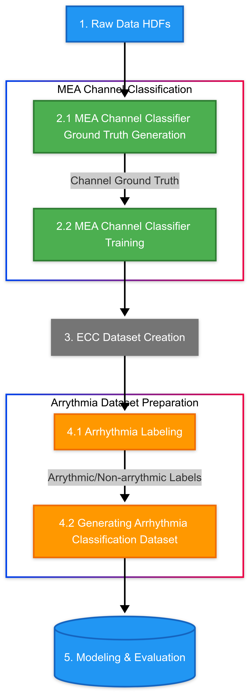

# Arrhythmia Classification on Excitation-Contracting Coupling (ECC) data from Bioartificial Cardiac Tissues (BCT)
## Overview

This project aims to classify arrhythmiac contractions in ECC data from BCT with the help of signal processing and machine learning techniques. This was done as a part of research project at myotwin GmbH.

## Workflow


## Data

The raw data zip file is available [here](https://myotwingmbh.sharepoint.com/:u:/s/core/ET95NpK70mBBiIVrzjoTTdwBmRjFOT7xfOX5lgj038683Q?e=dttXfO) to download. The structure of the data after zip extraction is as follows:

```
📁 <experiment_name>/
├── 📁 <bct_id>/
│   ├── 📁 <concentration_1>/
│   │   └── 📁 <Take>/
│   │       ├── 📁 Force/
│   │       ├── 📁 Calcium/
│   │       └── 📁 Mea/
│   │
│   └── 📁 <concentration_2>/
│       └── ...
│
└── ...
```

Where:
- `<experiment_name>`: Name of the experiment
- `<bct_id>`: Unique identifier for the BCT
- `<concentration_X>`: Different concentration levels
- `<Take>`: Individual recording session
  - `Force/`: Force measurement data
  - `Calcium/`: Calcium measurement data
  - `Mea/`: MEA recording data

## Setup
```
# install python3-tk (required for interactive labeling)
sudo apt-get install python3-tk
# create virtual environment
python3 -m venv env
# activate virtual environment
source env/bin/activate
# install dependencies
pip install -r requirements.txt
```

### Step 1: Generating Raw Data HDFs
- First, we need to generate HDFs from the raw data. This is done using the [`raw_transform.py`](./raw_transform.py) script. This script will generate HDFs for each concentration level in the raw data directory and place it in the output directory. The output HDFs will have the following file name format: `<experiment_name>_<bct_id>_<concentration_level>_<take_number>__raw_data.hdf`.   

    ```
    python3 raw_transform.py --raw-data-dir <path_to_raw_data> --output-dir <path_to_output_dir> --calcium_sampling_rate <calcium_sampling_rate_in_Hz> 

    where:
    - `<path_to_raw_data>`: Path to the raw data directory
    - `<path_to_output_dir>`: Path to the output directory
    - `<calcium_sampling_rate_in_Hz>`: Sampling rate of the calcium data in Hz

    # default values
    --raw-data-dir <path_to_raw_data> = "./Raw Data"
    --output-dir <path_to_output_dir> = "./RawHDFs"
    --calcium_sampling_rate = 100
    ```
- After this, we have to discard errored measurments which are `Out of Sync`, or `Complete Duplicates` or where MEA data is `Unavailable`. This information is stored in [`error_metadata.json`](./error_metadata.json) file. This file will be used in subsequent steps to filter out the errored measurments.
- For all the subsequent steps, we will refer to raw HDFs data directory as our main raw data directory.

### Step 2: MEA Channel Classification and Selection.

In this step, we identify the good MEA channels through the use of machine learning. Briefly:
- We first generate the small ground truth data for the MEA channels where for some randomly selected cases, we manually label the MEA channels as **good**, **medium**, **bad**.
- We then  extract statistical features from these MEA channels using [TSFEL](https://tsfel.readthedocs.io/en/latest/index.html).
- We then train a Random Forest classifier to classify the MEA channels into **good**, **medium**, **bad** based on the features extracted.
- The trained model is then used to classify the good MEA channels in the raw data HDFs and the average of the good MEA channels is taken to generate the final Field potential signal.

This subprocess is performed in [MeaChannelClassification](./MeaChannelClassification) directory. Technically the process is divided into two parts:

#### Sub-Step 2.1: Generating Channel Ground Truth Data
- For this step, we first need to look at the channels from MEA data for all cases available in the dataset. This can be done with [main.py](./MeaChannelClassification/main.py) script in [MeaChannelClassification](./MeaChannelClassification) directory.
    ```
    python3 main.py --plots 

    # Optional arguments for plot mode
    --plot_dir <path_to_plot_dir> = "./plots" (will be created if not present)
    --data_dir <path_to_raw_hdfs_data_dir> = "../RawHDFs"
    --error_metadata_file <path_to_error_metadata_file> = "../error_metadata.json"
    ```
- This will generate `8x4` plots for each MEA channel for each case in `<path_to_plot_dir>/raw`. We can manually see the channels and generate the ground truth data.
- The ground truth data should be stored in a `ground_truth.json` file in the [MeaChannelClassification](./MeaChannelClassification) directory with the following format:
    ```
    {
        "description": "Classification of MEA channels based on quality for N cases, serve as ground truth for MEA channel classification",
        "experiments": [
            {
                "name": "<case_name>", # <experiment_name>_<bct_id>_<concentration_level>_<take_number>
                "good_labels": ["<channel_1>", "<channel_2>", ...],
                "medium_labels": ["<channel_1>", "<channel_2>", ...],
            }
        ]
    }
    ```
- Ideally, 10-15 cases should be enough to generate a good ground truth data. The cases which are not covered in `good_labels` or `medium_labels` are considered as `bad` channels.
- After creating the ground truth file, we can visualize the ground truth plots using the following command:
    ```
    python3 main.py --plots --ground_truth_file <path_to_ground_truth_file> 

    # Rest of the optional arguments are same as in plot mode defined above
    ```
- This will generate the plots for ground truth cases with channel labels in `<path_to_plot_dir>/ground_truth` directory. This can be used to verify the ground truth data.

#### Sub-Step 2.2: Training the MEA Channel Classifier
- This step used the `ground_truth.json` file to train a Random Forest classifier to classify the MEA channels into **good**, **medium**, **bad** based on the statistical features extracted.
- This is also done using the [main.py](./MeaChannelClassification/main.py) script in [MeaChannelClassification](./MeaChannelClassification) directory. The arguments are different for `training` mode:
    ```
    python3 main.py --train --ground_truth_file <path_to_ground_truth_file>

    # Optional arguments for training mode
    --random_state <random_state> = 42
    --n_estimators <n_estimators> = 20
    --test_size <test_size> = 0.2
    --store_predictions <store_predictions> = False
    --data_dir <path_to_raw_hdfs_data_dir> = "../RawHDFs"
    --error_metadata_file <path_to_error_metadata_file> = "../error_metadata.json"
    --plot_dir <path_to_plot_dir> = "./plots" (will be created if not present)
    --model_dir <path_to_model_dir> = "./modeling" (will be created if not present, stores the trained model with evaluation artifacts)

    where:
     - --random_state is the random state for reproducibility
     - --test_size is the test size for train-test split
     - --store_predictions is a boolean flag to store the predictions of the classifier. If true, the prediction plots for each case with predicted channel labels will be stored in `<path_to_plot_dir>/predictions`
     - --data_dir is the path to the raw HDFs data directory
     - --error_metadata_file is the path to the error metadata file
     - --plot_dir is the path to the plot directory (will be created if not present)
    ```
- This will train the classifier, print the classification performance metrics and store the model with artifacts in `<path_to_model_dir>`. It also appends the timestamp to model artifacts to ensure uniqueness. The following files are stored in `<path_to_model_dir>`:
    ```
    - mea-channel-classification_<timestamp>_classification_dataset.csv: The dataset used for classifier training.
    - mea-channel-classification_<timestamp>_classification_results.json: The classification results of the classifier in json format on the test dataset. 
    - mea-channel-classification_<timestamp>_model.joblib: The trained model for classification.
    ```
- Moreover, if `--store_predictions` is set in `--train` mode, the predictions of the model on the entire dataset in the form of plots of each case with predicted channel labels will be stored in `<path_to_plot_dir>/predictions`.
- If the model is giving good results, we can take note of the model's path (file with `.joblib` extension) and use it in the next step during the generation of a single Field potential signal during ECC data generation.

    **Some Remarks:**
    - The `--plot` and `--train` modes are mutually exclusive. So [main.py](./MeaChannelClassification/main.py) can only be used for one of the two modes at a time.
    - The `--plots` mode can be used to visualize the plots for raw or ground truth data.
    - The `--train` mode can be used to train the classifier and store the model with artifacts.
    - Moreover, in `--plots` mode, we can also provide `--existing_model_path` to generate the plots for the predictions of the existing model. The path should be to the `.joblib` file of an existing trained model.
    - For better understanding, its suggested to have a look at the [main.py](./MeaChannelClassification/main.py) script in [MeaChannelClassification](./MeaChannelClassification.) directory.


### Step 3: Generating ECC Data
- In this step, we generate a preprocessed version of the data for `Force`, `Calcium` and `Field Potential` for each case in the dataset. The `Field Potential` is generated by averaging the good MEA channels predicted by the classifier trained in the previous step. 
- The peaks for the `Force` are also detected using `Prominence Thresholding` derived from Gaussian Fit around the Histogram maximum of the `Force` signal.
- This is performed using the [merge_ecc.py](./merge_ecc.py) script. The execution details are as follows:
    ```
    python3 merge_ecc.py --data_dir <path_to_raw_hdfs_data_dir> --mea_channel_classifier_path <path_to_mea_channel_classifier_path> --output_dir <path_to_output_dir> --mea_cases_filter <mea_cases_filter>
    --error_metadata_file <path_to_error_metadata_file>

    # Optional arguments
    --mea_good_channels_filter_params <mea_good_channels_filter_params> = dict(cutoff=180, order=5)

    where:
     - --data_dir is the path to the raw HDFs data directory (default: ../RawHDFs)
     - --mea_channel_classifier_path is the path to the trained model for MEA channel classification in `.joblib` format (step 2.2)
     - --output_dir is the path to the output directory (will be created if not present, default: ./Preprocessed)
     - --mea_cases_filter is the filter for MEA cases, as Field potential is only generated for cases with this string in the path (default: run1b)
     - --error_metadata_file is the path to the error metadata file (step 1, default: ../error_metadata.json)
     - --mea_good_channels_filter_params is the parameters for the good MEA channels low pass filter applied before averaging (default: dict(cutoff=180, order=5))
    ```
- This will generate the preprocessed data in the output directory with the following structure:
    ```
    📁 <output_dir>/
    ├── 📁 HDFs # HDFs of the preprocessed data with file name format: <experiment_name>_<bct_id>_<concentration_level>_<take_number>.hdf
    ├── 📁 Plots # Plots of the preprocessed vs raw data (force, calcium, field potential if applicable) alongwith detected force peaks for each case.
    ├── 📁 Peaks # Detected force peaks index information for each case in json format.
    ```
- These files in the output directory will be utilized for labeling and generating training data for the arrhythmia classification modeling.

### Step 4: Arrhythmia Dataset Preparation
- In this step, we prepare the dataset for the arrhythmia classification model. We first need to label each contraction event for all cases in the dataset as arrhythmic or normal.
- For this, we create a window of 3.0 seconds (1.5 seconds before and 1.5 seconds after) around each force peak and label the contraction event as arrhythmic if the force signal in this window is arrhythmic or normal otherwise.
- The same label gets transferred to the calcium and field potential signals for the corresponding contraction event window.
- In the next step, we divide this larger window into smaller subsizes of `[0.2, 0.3, 0.5, 0.7, 0.8, 0.9, 1.0, 1.2, 1.3, 1.5]` seconds and extract `statistical` and `all` features from these signals, again using TSFEL. `all` combines all features available in TSFEL.
- In this way, we have a different ground truth for each window size and each signal type.
- This ground truth data will be used in the final step to train the arrhythmia classification models and evaluate their performance.

Technically, this step is divided into two parts:

#### Sub-Step 4.1: Arrhythmia Labeling
- In this step, the utility script [labeling.py](./labeling.py) is used to label the data. 
- This script loads each case's preprocessed HDF file and generates a window plot for each contraction event sequentially. It discards first and last contraction events as most often they are incomplete.
- The user will have the option to label each contraction event individually or for the entire case at once after each window plot is displayed.
- The following labeling options will be available to the user:
    ```
    Y: Current peak is arrhythmic
    N: Current peak is normal
    A: All remaining peaks are arrhythmic
    P: All remaining peaks are normal
    D: Discard current peak
    S: Skip entire case
    ```
- If user selects `A` or `P`, the script will automatically label the remaining unlabelled peaks as arrhythmic or normal respectively for the current case.
- If user selects `D`, the current peak will be discarded and the script will move to the next peak in the current case.
- If user selects `S`, the script will skip the current case and move to the next case. It will also ignore the already labeled peaks in the current case.
- The script can be executed using the following command:
    ```
    python3 labeling.py --preprocessed_dir <path_to_preprocessed_data_dir> --error_metadata_file <path_to_error_metadata_file> --output_dir <path_to_output_dir> --window_size_seconds <window_size_seconds>

    where:
     - --preprocessed_dir is the path to the preprocessed data directory (default: ./Preprocessed)
     - --error_metadata_file is the path to the error metadata file (default: ../error_metadata.json)
     - --output_dir is the path to the output directory (will be created if not present, default: ./Labeled)
     - --window_size_seconds is the window size in seconds for labeling (default: 1.5, total window size is 3.0 seconds)
    ```
- This will generate a csv file for each signal type `(force, calcium, field_potential)` at `<path_to_output_dir>/Data/<signal_type>.csv`.
- These csv files will be used in the next step to create smaller windows and extract statistical features from these signals to generate final training data for the arrhythmia classification models.

    **Some Remarks & Caveats:**
    - To cancel execution of the script, press `Ctrl+C` and Enter. Only `Ctrl+C` without Enter will not cancel the execution.
    - The script only saves the label data for the current case after all of the peaks are labeled. So if the user cancels the execution midway, the labeled peaks data for the current case will be lost.
    - The script stores the metadata for already processed cases in `<path_to_output_dir>/metadata.json`. This metadata is used to skip already processed cases when the script is executed again.

#### Sub-Step 4.2: Generating Arrhythmia Classification Dataset
- In this step, the labeled windows from the previous step are used to generate the final training dataset for different window sizes and signal types.
- This is done using the [ground_truth.py](./ground_truth.py) script. The execution details are as follows:
    ```
    python3 ground_truth.py --label_data_dir <path_to_label_data_dir> --preprocessed_dir <path_to_preprocessed_dir> --raw_data_dir <path_to_raw_data_dir> --output_dir <path_to_output_dir>

    where:
     - --label_data_dir is the path to the labeled data directory (default: ./Labeled/Data)
     - --preprocessed_dir is the path to the preprocessed data directory (default: ./Preprocessed)
     - --raw_data_dir is the path to the raw data directory (default: ./RawHDFs)
     - --output_dir is the path to the output directory (will be created if not present, default: ./GroundTruth)
    ```
- This will generate a csv file for each window size at `<path_to_output_dir>/<signal_type>/<feature_type>/window_<window_size_seconds>s.csv`. This csv file contains the `statistical` and `all` features extracted for each contraction event in the dataset for the corresponding window size and signal type.
- These csv files will be used in the next step to train the arrhythmia classification models.

### Step 5: Modeling & Evaluation
- In this step, we train the arrhythmia classification models for each signal type using the ground truth data generated in the previous step.
- A different random forest with balanced class weights is trained for each signal type and window size.
- The best performing window model for each signal type is selected based on a criteria defined by the user from the following options:
    ```
    - f1_positive_class (F1 Score for arrhythmic contractions)
    - weighted_geometric_mean (Geometric mean of F1 Score for arrhythmic and normal contractions)
    - balanced_accuracy (Balanced accuracy)
    - roc_auc (ROC AUC Score)
    ```
- The user selects a single criterion from the above options. In case of a tie, the remaining metrics other than the selected one are used to break the tie. Models with smaller window size are preferred in case of a tie.
- The script [modeling.py](./modeling.py) can be executed using the following command:
    ```
    python3 modeling.py --ground_truth_dir <path_to_ground_truth_dir> --model_dir <path_to_model_dir> --test_size <test_size> --random_state <random_state> --n_estimators <n_estimators> --cross_validation_n_folds <cross_validation_n_folds> --evaluation_criteria <evaluation_criteria>

    where:
     - --ground_truth_dir is the path to the ground truth data directory created in step 4.2 (default: ./GroundTruth)
     - --model_dir is the path to the model directory (will be created if not present, default: ./Modeling)
     - --test_size is the test size for train-test split (default: 0.3)
     - --random_state is the random state for reproducibility (default: 42)
     - --n_estimators is the number of trees in the random forest (default: 50)
     - --cross_validation_n_folds is the number of folds in cross validation of each model (default: 10)
     - --cross_validation_n_repeats is the number of repeats in cross validation of each model (default: 3)
     - --evaluation_criteria is the evaluation criteria for selecting the best model (default: weighted_geometric_mean, Options: [f1_positive_class, weighted_geometric_mean, balanced_accuracy, roc_auc])
    ```
- This will train the models and report the best window size performing model for each signal type. The output artifacts for each signal type are stored in the timestamped directory for uniqueness. The following artifact structure is generated as a result of the execution:
    ```
    📁 <path_to_model_dir>/
    ├── 📁 <signal_type (force, calcium, field_potential)>/
    │   │   ├── training_run_<timestamp>/
    │   │   ├── training_metrics.csv: A csv file containing the test set metrics for each window size.
    │   │   ├── classification_report_best_window_<feature_type>_<best_window_size>s.txt: The classification report for the best window size model on test set.
    │   │   ├── metrics_best_window_<feature_type>_<best_window_size>s.json: The metrics for the best window size model on test set and cross validation metrics.
    │   │   ├── confusion_matrix_best_window_<feature_type>_<best_window_size>s.png: The confusion matrix for the best window size model on test set.
    │   │   ├── roc_curve_best_window_<feature_type>_<best_window_size>s.png: The ROC curve for the best window size model.
    │   │   ├── model_best_window_<feature_type>_<best_window_size>s.joblib: The best trained model for classification for the signal type based on the evaluation criteria.
    ```
- The best performing model for each signal type is stored in `<path_to_model_dir>/<signal_type>/training_run_<timestamp>/model_best_window_<feature_type>_<best_window_size>s.joblib`.
- The user can inspect the model's performance using the metrics and plots stored in the directory.
- The model can finally be used to predict whether a contraction event is arrhythmic or normal based on statistical features extracted around each contraction peak detected in the force signal. 
- The statistical features should be extracted with the best window size model for the corresponding signal type.

## Future Work
- The current workflow is dependent on detection of force peaks. For complete independent workflow for each signal type, we need to develop a method to detect the peaks for each signal type.
- Feature importance for Arrhythmia classification models could be used to identify the most important features for each signal type.
